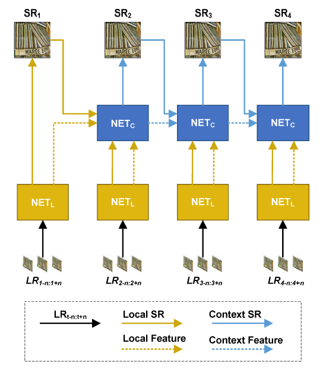
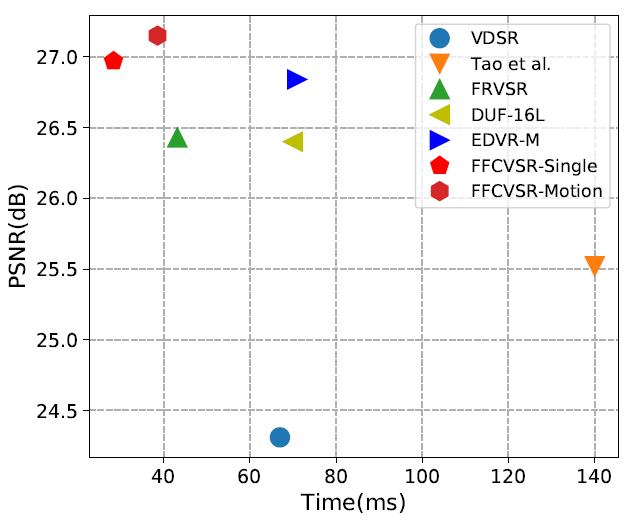

# FFCVSR (AAAI 2019)
[][license]

[license]: https://github.com/linchuming/FFCVSR/blob/master/LICENSE

AAAI 2019 paper "Frame and Feature-Context Video Super-Resolution" [1]  
[Paper](https://aaai.org/ojs/index.php/AAAI/article/view/4502)  



**FFCVSR-motion** is a improved version for **FFCVSR**, which adds motion prediction, feature alignment and gate selection.
The new version paper is submited to TPAMI 2020 and under review.

### Code

We release **FFCVSR** and **FFCVSR-motion** inference model and **FFCVSR-motion** training code in REDS dataset.

Our testing environment is:

- TensorFlow == 1.9
- Python 3.6
- NVIDIA GTX 1080Ti

### Inference

1. Download the pretrained checkpoints from WeiYun: https://share.weiyun.com/sEHySs5d

2. Testing model in VID4 dataset
```buildoutcfg
# testing FFCVSR model
python test_VID4_FFCVSR.py

# testing FFCVSR-motion model
python test_VID4_FFCVSR_motion.py

# compile inverse_warp cuda verison to speed up the FFCVSR-motion model if the OS is linux
cd custom_op
make
```

### Training
1. Download the REDS dataset (sharp type): https://seungjunnah.github.io/Datasets/reds

2. Put the REDS dataset in `datasets/REDS `

3. Generate tfrecords for REDS:
```buildoutcfg
python tfrecords/gen_REDS_tfrecords.py
```

4. Train the FFCVSR-motion
```buildoutcfg
python train_REDS_FFCVSR_motion.py
```

### VID4 Dataset Performance


| Methods       | Training Dataset | PSNR  | SSIM  | Inference Time |
| ------------- | ---------------- | ----- | ----- | -------------- |
| FFCVSR        | Internet Videos  | 26.97 | 0.815 | 28.4 ms        |
| FFCVSR-motion | REDS sharp       | 27.15 | 0.821 | 38.6 ms        |


### Citation

```
[1]  @inproceedings{ffcvsr,
         author = {Bo Yan, Chuming Lin, and Weimin Tan},
         title = {Frame and Feature-Context Video Super-Resolution},
         booktitle = {AAAI},
         year = {2019}
     }
```
